# IPTV WebExtension 播放器产品设计文档

## 1. 产品概述

### 1.1 产品定位
一款轻量级的浏览器扩展，用于导入 M3U 播放列表并播放 M3U8 直播流，兼容 Chrome/Edge 浏览器。

### 1.2 核心功能
- M3U 文件导入（支持拖拽和文件选择）
- M3U8 流媒体播放
- 频道列表管理与搜索
- 播放历史记录

### 1.3 技术原则
- 使用 Vanilla JavaScript，无框架依赖
- 最小化第三方库（仅 HLS.js 用于 M3U8 播放）
- 遵循 Manifest V3 规范

---

## 2. 架构设计

### 2.1 目录结构
```
iptvWebExt/
├── manifest.json              # 扩展配置文件
├── src/
│   ├── background/           # 后台服务
│   │   └── service-worker.js
│   ├── popup/               # 弹出窗口
│   │   ├── popup.html
│   │   ├── popup.css
│   │   └── popup.js
│   ├── options/             # 设置页面
│   │   ├── options.html
│   │   ├── options.css
│   │   └── options.js
│   ├── player/              # 播放器页面
│   │   ├── player.html
│   │   ├── player.css
│   │   └── player.js
│   └── shared/              # 共享模块
│       ├── storage.js       # 存储管理
│       ├── m3u-parser.js   # M3U 解析器
│       └── constants.js     # 常量定义
├── lib/                     # 第三方库
│   └── hls.min.js          # HLS.js (用于 m3u8 播放)
└── icons/                   # 图标资源
    ├── icon16.png
    ├── icon48.png
    └── icon128.png
```

### 2.2 技术栈

| 类别 | 技术选型 | 说明 |
|------|---------|------|
| 扩展规范 | Manifest V3 | Chrome/Edge 最新标准 |
| 前端语言 | Vanilla JavaScript ES6+ | 无框架依赖 |
| 样式 | CSS3 | 使用 CSS Grid/Flexbox |
| 存储 | chrome.storage.local | 持久化频道列表和配置 |
| 播放器 | HTML5 Video + HLS.js | M3U8 流媒体支持 |

---

## 3. 功能模块设计

### 3.1 M3U 解析器 (m3u-parser.js)

**职责**: 解析 M3U 文件，提取频道信息

**核心功能**:
```javascript
/**
 * 解析 M3U 文件内容
 * @param {string} content - M3U 文件内容
 * @returns {Array<Channel>} 频道列表
 */
function parseM3U(content)

/**
 * 频道数据结构
 * {
 *   id: string,           // 唯一标识
 *   name: string,         // 频道名称
 *   logo: string,         // 台标 URL
 *   group: string,        // 分组
 *   url: string,          // 流地址
 *   tvgId?: string,       // EPG ID
 *   tvgName?: string,     // EPG 名称
 * }
 */
```

**支持格式**:
- 标准 M3U 格式 (`#EXTINF`)
- tvg-id, tvg-name, tvg-logo 属性
- group-title 分组

---

### 3.2 存储管理 (storage.js)

**职责**: 封装 chrome.storage API，提供数据持久化

**核心接口**:
```javascript
// 频道列表管理
async saveChannels(channels: Channel[]): Promise<void>
async getChannels(): Promise<Channel[]>
async addChannel(channel: Channel): Promise<void>
async removeChannel(channelId: string): Promise<void>
async updateChannel(channelId: string, updates: Partial<Channel>): Promise<void>

// 播放历史
async addHistory(channel: Channel): Promise<void>
async getHistory(): Promise<Channel[]>
async clearHistory(): Promise<void>

// 用户配置
async saveSettings(settings: Settings): Promise<void>
async getSettings(): Promise<Settings>

/**
 * 设置数据结构
 * {
 *   defaultQuality: string,    // 默认画质
 *   autoPlay: boolean,         // 自动播放
 *   volume: number,            // 音量 (0-100)
 * }
 */
```

---

### 3.3 弹出窗口 (Popup)

**文件**: `src/popup/`

**功能**: 快速访问频道列表和启动播放器

**UI 布局**:
```
+----------------------------------+
| IPTV Player           [⚙] [?]   |
+----------------------------------+
| [🔍 搜索频道...]                  |
+----------------------------------+
| 📺 央视频道                      |
|   CCTV-1                         |
|   CCTV-2                         |
|                                  |
| 📺 卫视频道                      |
|   湖南卫视                       |
|   浙江卫视                       |
|                                  |
| 📺 地方台                        |
|   ...                            |
+----------------------------------+
| [📁 导入 M3U]  [🕒 历史]         |
+----------------------------------+
```

**交互流程**:
1. 点击频道 → 在新标签页打开播放器
2. 点击导入 → 打开文件选择器
3. 点击历史 → 显示播放历史列表

---

### 3.4 播放器页面 (Player)

**文件**: `src/player/`

**功能**: 全屏播放 M3U8 流媒体

**UI 布局**:
```
+----------------------------------+
| ← 返回    CCTV-1 高清  [📄]     |
+----------------------------------+
|                                  |
|                                  |
|        [ Video Player ]          |
|                                  |
|                                  |
+----------------------------------+
| ▶️  ⏸  🔊  🔇  📺  ⛶PIPSU        |
+----------------------------------+
| 频道列表: [📋]                    |
| Related:                          |
|   CCTV-2  CCTV-3  CCTV-4          |
+----------------------------------+
```

**核心功能**:
- HLS.js 集成播放
- 画中画模式
- 键盘快捷键（空格暂停、方向键切换频道）
- 播放错误重试机制
- 频道快速切换侧边栏

---

### 3.5 设置页面 (Options)

**文件**: `src/options/`

**功能**: 管理导入的频道列表和配置

**UI 布局**:
```
+----------------------------------+
| 设置                      |
+----------------------------------+
| Tabs: [频道管理] [播放设置] [关于] |
+----------------------------------+
| 频道管理                         |
| 总计: 128 个频道                 |
| [📁 导入 M3U 文件] [🗑️ 清空]     |
|                                  |
| +----------+--------------------+-+
| | 频道名   | URL                | |
| +----------+--------------------+-+
| | CCTV-1   | http://...         | ✕ |
| | CCTV-2   | http://...         | ✕ |
| +----------+--------------------+-+
| [搜索...]                       |
+----------------------------------+
```

---

## 4. 数据流设计

### 4.1 M3U 导入流程

```mermaid
graph LR
    A[用户选择 M3U 文件] --> B[FileReader 读取]
    B --> C[m3uParser.parseM3U]
    C --> D[去重处理]
    D --> E[storage.saveChannels]
    E --> F[更新 Popup 显示]
```



### 4.2 播放流程

```mermaid
graph LR
    A[用户点击频道] --> B[打开 player.html]
    B --> C[从 URL 参数获取频道ID]
    C --> D[storage.getChannels]
    D --> E[初始化 HLS.js]
    E --> F[加载流]
    F --> G[storage.addHistory]
```



---

## 5. 权限申请

```json
{
  "permissions": [
    "storage"          // 数据存储
  ],
  "host_permissions": [
    "*://*/*"          // 允许加载所有域名的 m3u8 流
  ]
}
```

---

## 6. 第三方依赖

### 6.1 HLS.js
- **版本**: ^1.4.0
- **用途**: 在非 Safari 浏览器播放 M3U8
- **CDN**: `https://cdn.jsdelivr.net/npm/hls.js@latest/dist/hls.min.js`
- **大小**: ~300KB (minified)

### 6.2 依赖说明
仅使用 HLS.js 一个第三方库，其余全部使用原生 Web API。

---

## 7. 浏览器兼容性

| 浏览器 | 最低版本 | 备注 |
|--------|---------|------|
| Chrome | 88+ | Manifest V3 支持 |
| Edge | 88+ | Chromium 内核 |
| Firefox | 不支持 | 需要另行适配 |
| Safari | 不支持 | 原生支持 HLS，但扩展 API 不同 |

---

## 8. 安全考虑

### 8.1 内容安全策略 (CSP)
```json
"content_security_policy": {
  "extension_pages": "script-src 'self'; object-src 'self'"
}
```

### 8.2 数据验证
- M3U URL 格式验证
- XSS 防护（频道名称转义）
- 存储数据大小限制（chrome.storage.local 限制 10MB）

---

## 9. 性能优化

### 9.1 列表虚拟化
频道列表超过 100 条时使用虚拟滚动

### 9.2 延迟加载
HLS.js 按需加载，仅在播放器页面引入

### 9.3 图片懒加载
频道台标使用 Intersection Observer 延迟加载

---

## 10. 后续扩展方向

### 10.1 短期计划
- [ ] EPG 电子节目单支持
- [ ] 收藏夹功能
- [ ] 频道分组折叠

### 10.2 长期计划
- [ ] 多语言支持
- [ ] 自定义主题
- [ ] 遥控器快捷键支持
- [ ] Firefox 适配

---

## 11. 开发里程碑

| 阶段 | 目标 | 交付物 |
|------|------|--------|
| Phase 1 | 基础播放 | M3U 解析、HLS 播放 |
| Phase 2 | 管理功能 | 设置页面、频道管理 |
| Phase 3 | 体验优化 | 搜索、历史、快捷键 |
| Phase 4 | 发布 | 商店审核上架 |

---

## 附录

### A. M3U 文件示例
```m3u
#EXTM3U
#EXTINF:-1 tvg-id="CCTV1" tvg-name="CCTV1" tvg-logo="http://example.com/cctv1.png" group-title="央视",CCTV-1
http://example.com/live/cctv1.m3u8
#EXTINF:-1 tvg-id="CCTV2" tvg-name="CCTV2" tvg-logo="http://example.com/cctv2.png" group-title="央视",CCTV-2
http://example.com/live/cctv2.m3u8
```

### B. 参考资源
- [Chrome Extension Manifest V3](https://developer.chrome.com/docs/extensions/mv3/)
- [HLS.js Documentation](https://github.com/video-dev/hls.js/)
- [M3U File Format](https://en.wikipedia.org/wiki/M3U)

---

**文档版本**: 1.0
**最后更新**: 2026-02-24
**维护者**: IPTV WebExtension Team
